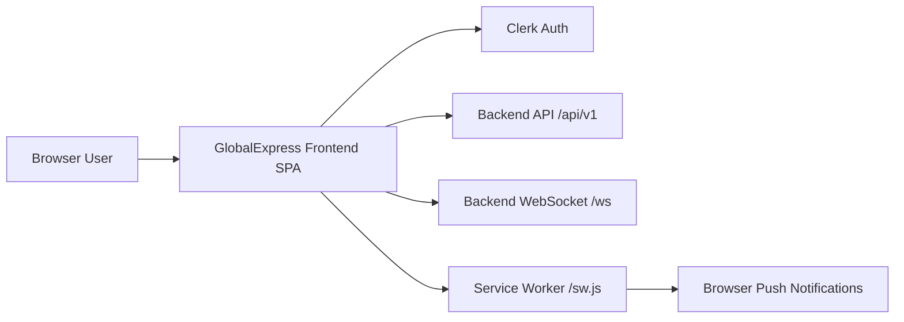
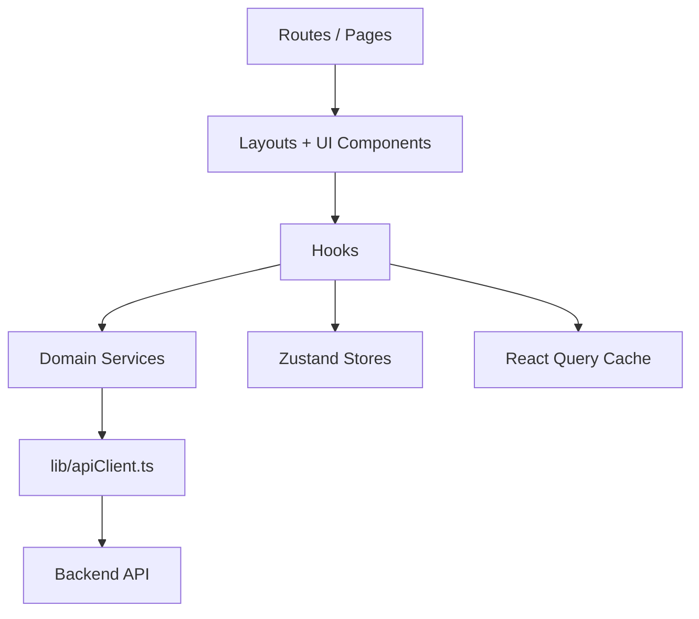

# GlobalExpress Dashboard (Frontend)

Operational dashboard and customer portal for GlobalExpress logistics workflows.  
This app supports customer tracking, shipment management, orders, payments, support tickets, internal admin/staff operations, and a launch-gate countdown mode for production rollout control.

## Table of Contents

- [Overview](#overview)
- [Architecture](#architecture)
- [Core User Flows](#core-user-flows)
- [Routing and Access Control](#routing-and-access-control)
- [Project Structure](#project-structure)
- [Configuration and Environment Variables](#configuration-and-environment-variables)
- [Local Development](#local-development)
- [Testing and Quality Gates](#testing-and-quality-gates)
- [Deployment Notes](#deployment-notes)
- [Operational Notes](#operational-notes)
- [Troubleshooting](#troubleshooting)

## Overview

### Main Capabilities

- Hybrid authentication:
  - Internal credential auth for staff/admin flows.
  - Clerk auth for customer sign-in/up flows.
- Role-aware app shell and protected routes:
  - `user`, `staff`, `admin`, `superadmin`.
- Domain modules:
  - Dashboard, Shipments, Orders, Clients, Team, Notifications, Payments, Support, Reports, Bulk Orders, Settings.
- Realtime updates:
  - WebSocket-driven ticket and notification refresh.
- Push notifications:
  - Service worker + VAPID subscription for operator users.
- Internationalization:
  - English and Korean translations via `i18next`.
- Launch gate:
  - Optional global countdown page that can lock all routes during pre-launch.

### Tech Stack

| Area | Technology |
|---|---|
| UI | React 19 + TypeScript |
| Build Tool | Vite 7 |
| Routing | React Router |
| Server State | TanStack Query |
| Client State | Zustand + React Context |
| Styling | Tailwind CSS v4 |
| Forms | React Hook Form + Zod |
| Auth Provider | Clerk (`@clerk/clerk-react`) |
| Testing | Vitest + Testing Library + Playwright |
| Linting | ESLint 9 |

## Architecture

### System Context



### Frontend Layers



### Route Gating Flow

```mermaid
flowchart TD
  Start[App Boot] --> Gate{isLaunchGateActive()}
  Gate -->|true| Countdown[Render Landing Countdown for ALL paths]
  Gate -->|false| Normal[Render normal route table]
  Normal --> Protected{ProtectedRoute checks}
  Protected -->|pass| Module[Page Module]
  Protected -->|fail| Redirect[Login / Forbidden / Dashboard redirect]
```

## Core User Flows

### 1) Authentication

- App boot mounts providers in `src/main.tsx`:
  - `ClerkProvider`
  - `QueryClientProvider`
  - `AuthProvider`
- `AuthProvider` (`src/store/auth/AuthContext.tsx`) handles:
  - Internal JWT read/write in `localStorage` (`globalxpress_token`).
  - Session bootstrap via `getMe()`.
  - Role validation and language sync.
- `ProtectedRoute` resolves effective auth:
  - Internal JWT session takes precedence.
  - Clerk session is treated as `user` when internal session is absent.

### 2) Data Fetching

- Services in `src/services/*` define domain-level API operations.
- `src/lib/apiClient.ts` centralizes `GET/POST/PUT/PATCH/DELETE` with:
  - Base URL from `VITE_API_BASE_URL`.
  - Authorization header handling.
  - 429 toast feedback.
  - Sanitized fallback error messages.

### 3) Realtime and Push

- `useWebSocket` builds WS URL from API base and keeps query caches in sync.
- Support message/ticket and notification events trigger invalidations and toasts.
- `usePushNotifications` registers `/sw.js`, requests permission, and sends subscription to backend.

### 4) Launch Gate / Countdown

- Controlled by env in `src/constants/launchGate.ts`.
- When enabled, `AppRoutes` short-circuits all routes to `LandingPage`.
- Countdown target timestamp is configurable (`VITE_LAUNCH_GATE_TARGET_UTC`).

### 5) Provisioning Gate (Login UI Hold)

- Controlled by env in `src/constants/provisioningGate.ts`.
- Keeps login forms visible but blocks submit for internal (`/login`) and external (`/sign-in`) flows.
- Shows a frontend-only popup message and countdown so users know provisioning is still in progress.

## Routing and Access Control

### Public Routes

- `/` (landing or countdown)
- `/login`
- `/sign-in`
- `/sign-up` and `/signup`
- `/forgot-password`
- `/track` and `/track/:trackingNumber`
- `/complete-profile`
- `/staff-onboarding`

### Protected Route Groups

| Route Group | Access |
|---|---|
| `/dashboard` | `user` |
| `/admin/dashboard` | `staff`, `admin`, `superadmin` |
| `/clients`, `/reports` | `admin`, `superadmin` |
| `/bulk-orders` | `staff`, `admin`, `superadmin` |
| Most operational modules (`/shipments`, `/orders`, `/settings`, `/support`, etc.) | Authenticated users, with per-route role guards where configured |

Source of truth: `src/App.tsx` + `src/components/auth/ProtectedRoute.tsx`.

## Project Structure

### Top-Level

```text
.
├── e2e/                      # Playwright tests
├── public/                   # Static assets + service worker
├── src/
│   ├── components/           # UI, auth, forms, layout, onboarding
│   ├── constants/            # routes, launch gate, feedback messages
│   ├── data/                 # mock data fixtures
│   ├── hooks/                # domain and app hooks
│   ├── i18n/                 # i18next setup + locale JSON
│   ├── lib/                  # api client, query client, helpers
│   ├── pages/                # route-level feature modules
│   ├── services/             # API/domain service layer
│   ├── store/                # auth context + zustand stores
│   ├── test/                 # test setup
│   ├── types/                # shared TypeScript types
│   └── utils/                # utility functions
├── playwright.config.ts
├── vite.config.ts
└── vercel.json
```

### Important Files Map

| File | Purpose |
|---|---|
| `src/main.tsx` | App bootstrap and top-level providers |
| `src/App.tsx` | Route table + launch-gate short-circuit |
| `src/store/auth/AuthContext.tsx` | Internal auth state, token/session lifecycle |
| `src/components/auth/ProtectedRoute.tsx` | Role and auth gating |
| `src/lib/apiClient.ts` | Shared HTTP request abstraction |
| `src/constants/launchGate.ts` | Environment-driven countdown gate logic |
| `src/hooks/useWebSocket.ts` | WS connection + cache invalidation events |
| `src/hooks/usePushNotifications.ts` | Push subscription registration |
| `public/sw.js` | Service worker for push display/click behavior |
| `src/i18n/i18n.ts` | i18n initialization + language resources |

### Feature Module Index

| Feature | Primary Page Entry |
|---|---|
| Landing / Launch Gate | `src/pages/auth/LandingPage/LandingPage.tsx` |
| Internal Login | `src/pages/auth/LoginPage/LoginPage.tsx` |
| External Customer Sign-In | `src/pages/auth/ExternalSignInPage/ExternalSignInPage.tsx` |
| External Customer Sign-Up | `src/pages/auth/ExternalSignUpPage/ExternalSignUpPage.tsx` |
| Staff Onboarding | `src/pages/auth/StaffOnboardingPage/StaffOnboardingPage.tsx` |
| Dashboard (Customer) | `src/pages/dashboard/DashboardPage/DashboardPage.tsx` |
| Dashboard (Admin/Staff) | `src/pages/admin/AdminDashboardPage/AdminDashboardPage.tsx` |
| Shipments List | `src/pages/shipments/ShipmentsPage/ShipmentsPage.tsx` |
| New Shipment | `src/pages/shipments/NewShipmentPage/NewShipmentPage.tsx` |
| Track Shipment (Internal) | `src/pages/shipments/TrackShipmentPage/TrackShipmentPage.tsx` |
| Public Tracking | `src/pages/public/TrackPage/TrackPage.tsx` |
| Orders | `src/pages/orders/OrdersPage/OrdersPage.tsx` |
| Clients | `src/pages/clients/ClientsPage/ClientsPage.tsx` |
| Team | `src/pages/team/TeamPage/TeamPage.tsx` |
| Notifications | `src/pages/notifications/NotificationsPage/NotificationsPage.tsx` |
| Support | `src/pages/support/SupportPage/SupportPage.tsx` |
| Payments | `src/pages/payments/PaymentsPage/PaymentsPage.tsx` |
| Reports | `src/pages/reports/ReportsPage/ReportsPage.tsx` |
| Bulk Orders | `src/pages/bulkOrders/BulkOrdersPage/BulkOrdersPage.tsx` |
| Settings | `src/pages/settings/SettingsPage/SettingsPage.tsx` |

### Service Layer Map

| Service File | Responsibility |
|---|---|
| `src/services/authService.ts` | Internal auth, profile, onboarding settings, account export |
| `src/services/dashboardService.ts` | Dashboard aggregation and response mapping |
| `src/services/shipmentsService.ts` | Shipment listing and dashboard summaries |
| `src/services/ordersService.ts` | Order CRUD, status, timeline, pricing estimate |
| `src/services/clientsService.ts` | Client management and related orders |
| `src/services/teamService.ts` | Team member approval and creation |
| `src/services/supportService.ts` | Ticket list/detail, ticket messaging, status updates |
| `src/services/notificationsService.ts` | Notification list, read state, save, broadcast |
| `src/services/paymentsService.ts` | Payment initialization, verification, listing |
| `src/services/bulkOrdersService.ts` | Bulk order operations and item management |
| `src/services/reportsService.ts` | KPI/report endpoints and analytics datasets |
| `src/services/settingsService.ts` | Logistics settings, FX, templates, restrictions |
| `src/services/uploadsService.ts` | Presigned upload, confirm upload, image delete |
| `src/services/pushService.ts` | VAPID key fetch and push subscription registration |
| `src/services/adminUsersService.ts` | Internal user administration and role updates |

### State Management Map

| State Area | Implementation | File |
|---|---|---|
| Authentication state | React Context | `src/store/auth/AuthContext.tsx` |
| Language preference | Zustand | `src/store/language/language.store.ts` |
| Search query | Zustand | `src/store/search/search.store.ts` |
| WebSocket connection | Zustand | `src/store/websocket/websocket.store.ts` |
| Toast/feedback center | Zustand | `src/store/feedback/feedback.store.ts` |

## Configuration and Environment Variables

This repo ignores all `.env*` files except `.env.example`.

### Required

| Variable | Description |
|---|---|
| `VITE_CLERK_PUBLISHABLE_KEY` | Clerk frontend publishable key (required on app boot) |
| `VITE_API_BASE_URL` | Backend API base URL, expected to include `/api/v1` |

### Launch Gate Controls

| Variable | Description | Example |
|---|---|---|
| `VITE_LAUNCH_GATE_ENABLED` | Forces countdown route lock on/off | `true` or `false` |
| `VITE_LAUNCH_GATE_TARGET_UTC` | Countdown target timestamp (ISO or epoch ms) | `2026-04-18T00:00:00Z` |
| `VITE_PROVISIONING_GATE_ENABLED` | Blocks login submit (forms remain visible) | `true` or `false` |
| `VITE_PROVISIONING_GATE_TARGET_UTC` | Provisioning unlock timestamp (ISO or epoch ms) | `2026-04-20T00:00:00Z` |

Default behavior if `VITE_LAUNCH_GATE_ENABLED` is omitted:

- `true` in production builds
- `false` in local development

## Local Development

### Prerequisites

- Node.js 20+
- npm 10+

### Setup

```bash
npm install
cp .env.example .env
```

### Run

```bash
npm run dev
```

Vite defaults to `http://localhost:5173`.

## Testing and Quality Gates

### Unit / Integration

```bash
npm run test
```

### E2E (Playwright)

```bash
npm run e2e
```

If browsers are missing:

```bash
npx playwright install
```

### Lint + Typecheck + Build

```bash
npm run lint
npm run typecheck
npm run build
```

### Full Verification

```bash
npm run verify
```

## Deployment Notes

- `vercel.json` rewrites all paths to `index.html` for SPA routing.
- Production build command:

```bash
npm run build
```

- Ensure production env variables are set in your host platform.
- To hold public access behind countdown during rollout:
  - Set `VITE_LAUNCH_GATE_ENABLED=true`.
- To keep login forms visible but block authentication during propagation:
  - Set `VITE_PROVISIONING_GATE_ENABLED=true`.

## Operational Notes

### Git Hooks

- `pre-commit`: runs `lint` and `typecheck`.
- `pre-push`: runs `build`.

### Security Hygiene

- Never commit real `.env` values.
- Use `.env.example` for onboarding.
- If any secret was previously committed, rotate it immediately.

### i18n Behavior

- Supported languages: `en`, `ko`.
- Language persists in `localStorage` (`globalxpress_language`).
- Preferred language is best-effort synced back to backend.

## Troubleshooting

### App throws `Missing VITE_CLERK_PUBLISHABLE_KEY`

- Ensure `VITE_CLERK_PUBLISHABLE_KEY` is present in `.env`.

### API requests fail immediately

- Verify `VITE_API_BASE_URL` is correct and reachable.
- Confirm it includes `/api/v1` as expected by current services.

### WebSocket does not connect

- WS URL is derived from `VITE_API_BASE_URL`.
- Confirm backend exposes `/ws` and accepts the same auth token.

### Countdown appears locally when not expected

- Set `VITE_LAUNCH_GATE_ENABLED=false` in local `.env`.
- Restart dev server after env changes.

### Login is blocked with provisioning message

- Set `VITE_PROVISIONING_GATE_ENABLED=false` in local `.env`.
- Restart dev server after env changes.
